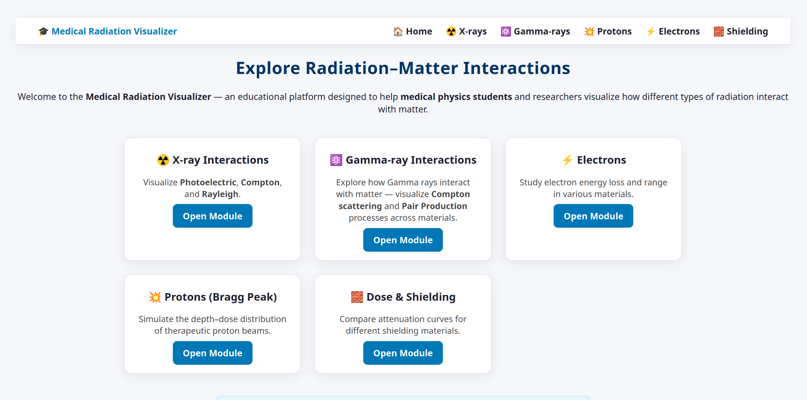
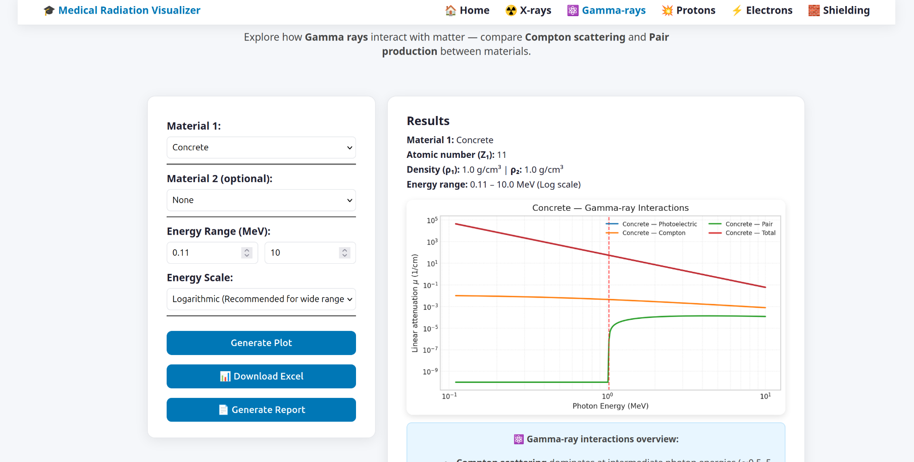

# 🎓 Medical Radiation Visualizer

An **interactive educational toolkit** built with **Python + Flask** to visualize how different types of radiation interact with matter — designed for **medical physics students and researchers**.

---

## 🔔 What’s New (Oct 2025)

* ✅ **X-ray:** Added **K-edge visualization** for high-Z materials.  
* ✅ **Gamma-ray:** Added **axis toggle (Linear/Log)** for cross-section and attenuation plots.  
* 🧪 **Proton:** Added **scientific PDF reports** with dynamic titles, data tables, and export functions.  
* ⚙️ **Unified JS/AJAX backend:** Single handler for all modules (`main.js`).  
* 🧩 **Enhanced constants database:** Accurate **mean excitation energies (I-values)** sourced from NIST/ICRU.  
* 💾 **Full export support:** Excel (.xlsx) and PDF report generation built-in.  
* 🚧 **Electrons & Shielding:** Framework structure now in place; physics modules under development.


---

## 🧠 Overview

This project provides simplified, didactic simulations of major radiation–matter interactions:

| Module                     | Description                                                                                          |
|----------------------------|------------------------------------------------------------------------------------------------------|
| ☢️ **X-ray Interactions**     | Visualizes photoelectric, Compton and Rayleigh interactions, includes **K-edge highlighting**.      |
| ⚛️ **Gamma-ray Interactions** | Shows attenuation/cross-section vs. energy, supports **Log/Linear axis toggle** and pair production.|
| ⚡ **Electrons**             | *(Coming soon)* Simulates collisional + radiative losses, CSDA range, angular scattering.          |
| 💥 **Protons (Bragg Peak)**   | Displays stopping power and depth–dose curves typical of medical physics applications.             |
| 🧱 **Shielding / Dose Attenuation** | *(Coming soon)* Compares material shielding performance (HVL, TVL, attenuation laws).         |

> **Note:** All models are simplified for teaching and research only — they are *not* to be used for clinical dose calculation or patient treatment planning.


---

---
### 🔬 Interface Preview





---

## 🧱 Project Structure

```
MedicalRadiationVisualizer/
├── app.py                      # Flask entry point
│
├── core/
│   ├── utils.py                # Shared helper functions
│   └── constants.py            # Global constants (Z_MAP, materials, defaults)
│
├── modules/
│   ├── xray/                   # X-ray simulation (photoelectric, Compton, Rayleigh, K-edge)
│   ├── gamma/                  # Gamma simulation (Compton, PP, log/linear axis toggle)
│   ├── protons/                # Bragg Peak simulation
│   ├── electrons/              # Electron energy loss & range
│   └── shielding/              # Attenuation / HVL comparison
│
├── templates/                  # HTML views (Flask Jinja)
│   ├── index.html              # Main dashboard
│   ├── xray.html               # X-ray interaction interface (with K-edge highlight)
│   ├── gamma.html              # Gamma interface (axis toggle: Log/Linear)
│   ├── proton.html             # Bragg Peak simulator
│   ├── electron.html           # Electron visualization
│   └── shielding.html          # Shielding comparison
│
├── static/
│   ├── css/
│   │   └── style.css           # Unified academic styling
│   ├── js/
│   │   └── main.js             # Unified AJAX handlers for all modules
│   └── plots/                  # Generated charts (PNG)
│   │               
    └── fonts/ 
│
└── requirements.txt
```

---

## ⚙️ Installation

### 1️⃣ Create a virtual environment

```bash
python3 -m venv .venv
source .venv/bin/activate
```

### 2️⃣ Install dependencies

```bash
pip install -r requirements.txt
```

### 3️⃣ Run the app

```bash
python app.py
```

Then open:

> 🌐 [http://127.0.0.1:5000/](http://127.0.0.1:5000/)

---

## 🧩 Technologies Used

* **Python 3.12+**
* **Flask 3.0+**
* **Matplotlib**
* **NumPy**
* *(Optional)* **pyngrok** — to expose your app temporarily.

---

## 🧪 Educational Goals

This project helps students **visualize radiation–matter interactions** and understand:

* Differences in dose deposition between photons, electrons, and protons.
* Dependence of attenuation on atomic number and energy (incl. **K-edge** behavior).
* Bragg Peak and its medical significance.
* Comparative shielding efficiency across materials.
* Effect of **axis scaling (Log vs Linear)** on interpreting gamma data.

---

## 🔧 Feature Notes
### ⚡ Electron Interaction Visualizer *(in development)*
- Will integrate **collisional (Bethe)** and **radiative (Bremsstrahlung)** losses.  
- Computes **total stopping power** and **CSDA range** through numerical integration.  
- Plans to include **Highland multiple-scattering** model for angular dispersion.  
- Target outputs: stopping-power curve, Bragg-like dose curve, and angular spread vs depth.

---

### 🧱 Shielding and Dose Attenuation *(in development)*
- Uses **Beer–Lambert attenuation law** to compare transmission through multiple materials.  
- Will calculate **HVL / TVL** and show exponential decay curves with selectable photon energies.  
- PDF and Excel exports planned with automatic energy-dependent attenuation tables.  
- Designed for future expansion to **multilayer composite shields**.

---

### 🧩 System-wide Features
- Unified **AJAX backend** (`main.js`) handles all modules asynchronously for smooth user experience.  
- Centralized constants (`core/constants.py`) provide validated Z, ρ, and K/L-edge data from NIST/ICRU references.  
- Academic-style **PDF report system** used consistently across all modules.  
- Modular design: each interaction type (X-ray, Gamma, Proton, etc.) in its own independent Flask blueprint.  
- Interface uses **responsive two-column layout** for inputs and plots, ensuring readability on any device.

---

> These features are designed to bridge theoretical radiation physics and interactive visualization — making complex phenomena intuitive, quantitative, and visually clear for students and researchers.


---

## 🚀 Run on Google Colab (Optional)

You can experiment with simplified versions of each module directly on Google Colab without local setup:

```python
!git clone https://github.com/hassony/MedicalRadiationVisualizer.git
%cd MedicalRadiationVisualizer
!pip install -r requirements.txt

# (Optional) expose Flask via ngrok
from pyngrok import ngrok
!python app.py &
public_url = ngrok.connect(5000)
print("App running at:", public_url)
```


## ⚠️ Disclaimer

> This software is **for educational and research training purposes only**.
> Do not use it for clinical treatment planning or real patient dose estimation.

---

## 💖 Support the Project

This project is self-funded and developed by **Hassan Almoosa**.  
If you find it useful for education or research, consider supporting its continuation:

- 💸 Donate via PayPal: [https://paypal.me/7asson999]
- 🌟 Or simply star the repo to show support!

Your help keeps this educational tool alive and evolving.

## 📜 License

Apache License 2.0
© 2025 Hassan Almoosa
Licensed under the Apache License, Version 2.0 (the “License”); you may not use this file except in compliance with the License.
You may obtain a copy of the License at:

https://www.apache.org/licenses/LICENSE-2.0

---

## ⭐ Acknowledgements

Inspired by the goal of making **medical physics** education accessible and interactive.
Thanks to educators who blend theory with visualization.

---
